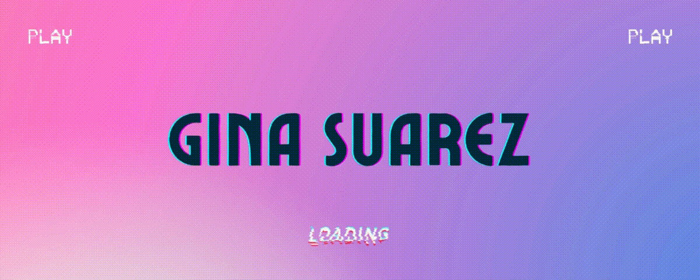
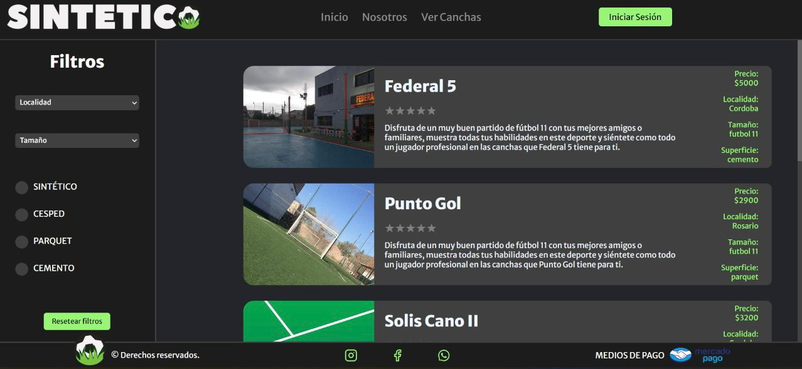
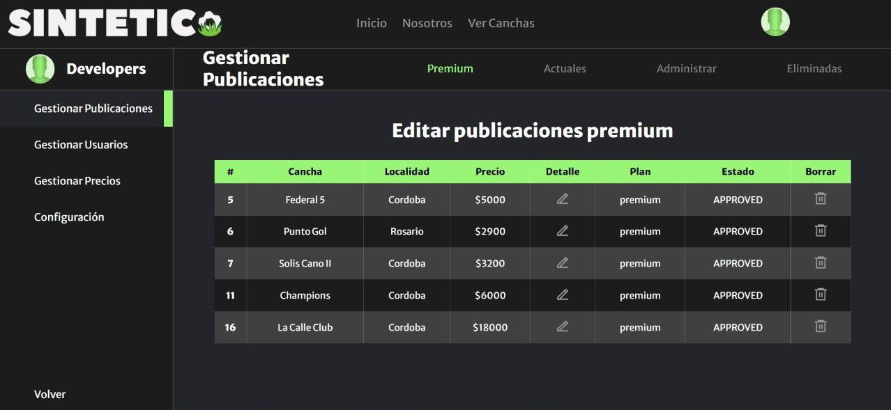
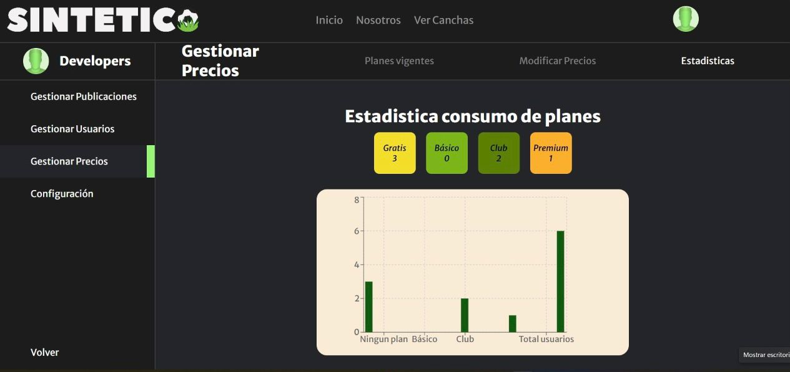
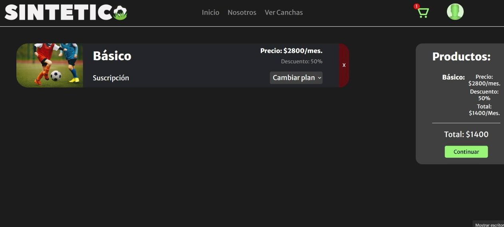

### Hi there, I am Gina Suarez👋👩‍💻

 

 
  

I am a Full Stack Developer from www.soyhenry.com, I am interested in the world of software development and also in the constant learning of new technologies.

 

<h3 align="left">Lenguajes y Tecnologias</h3>

 
 
 
 
 
 
 
 
 
 
  
  
  

 

<h3>🚀 Proyects 🚀 </h3>

<h3>Sintetico </h3>
The project consists of a web application to reserve soccer fields, there you can make reservations for fields, buy plans to become a club user and publish your club and make them known to the platform. We handle different technologies in the creation of the project such as:
  

 ♦React
 ♦Redux
 ♦Html 
 ♦CSS
 ♦Scrum
 ♦Express
 ♦Sequelize
 ♦PostgreSQL
 ♦Potsman
 ♦Git
 ♦GitHub
 
 <a href="https://sintetico.vercel.app/" target="_blank"> https://sintetico.vercel.app/</a>

 

 

<h3> 💌 Contact me: ⤵️ </h3>

 &nbsp&nbsp<a href="https://www.linkedin.com/in/gina-suarez/" target="_blank">LinkedIn</a>

 &nbsp ginin_95@hotmail.com

